## 画图基础
画图参考 [matplotlib](http://matplotlib.org/)


```python
import numpy as np
import matplotlib as mpl
import matplotlib.pyplot as plt
#import warnings; warnings.simplefilter('ignore')
# import seaborn as sns; sns.set()
%matplotlib inline
```

## One-Dimensional Data Set

+ 随机数


```python
np.random.seed(1000)
y = np.random.standard_normal(20) 
```

+ 画图


```python
x = range(len(y))
plt.plot(x, y)
# tag: matplotlib_0
# title: Plot given x- and y-values
```


    

    


+ 增加网格，让坐标紧凑


```python
plt.plot(y.cumsum())
plt.grid(True)  # adds a grid
plt.axis('tight')  # adjusts the axis ranges
# tag: matplotlib_3_a
# title: Plot with grid and tight axes
```


    (-0.9500000000000001, 19.95, -2.322818663749045, 0.5655085808655865)


    
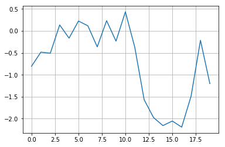
    


修改坐标起始点


```python
plt.plot(y.cumsum())
plt.grid(True)
plt.xlim(-1, 20)
plt.ylim(np.min(y.cumsum()) - 1,
         np.max(y.cumsum()) + 1)
# tag: matplotlib_3_b
# title: Plot with custom axes limits
```


    (-3.1915310617211072, 1.4342209788376488)


    
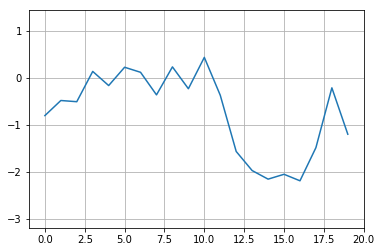
    


+ 设置图形大小，设置线点性状、颜色、宽度
+ 设置图形横坐标，纵坐标标题


```python
plt.figure(figsize=(7, 4))
  # the figsize parameter defines the
  # size of the figure in (width, height)
plt.plot(y.cumsum(), 'b', lw=1.5)
plt.plot(y.cumsum(), 'ro')
plt.grid(True)
plt.axis('tight')
plt.xlabel('index')
plt.ylabel('value')
plt.title('A Simple Plot')
# tag: matplotlib_4
# title: Plot with typical labels


```


    Text(0.5,1,'A Simple Plot')


    
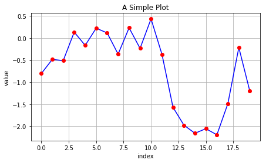
    


## Two-Dimensional Data Set


```python
np.random.seed(2000)
y = np.random.standard_normal((20, 2)).cumsum(axis=0)
```


```python
plt.figure(figsize=(7, 4))
#颜色自动匹配
plt.plot(y, lw=1.5)
  # plots two lines
plt.plot(y, 'ro')
  # plots two dotted lines
plt.grid(True)
plt.axis('tight')
plt.xlabel('index')
plt.ylabel('value')
plt.title('A Simple Plot')
# tag: matplotlib_5
# title: Plot with two data sets


```


    Text(0.5,1,'A Simple Plot')


    
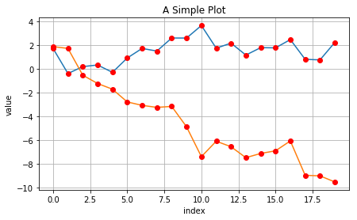
    


+ 添加题注


```python
plt.figure(figsize=(7, 4))
plt.plot(y[:, 0], lw=1.5, label='1st')
plt.plot(y[:, 1], lw=1.5, label='2nd')
plt.plot(y, 'ro')
plt.grid(True)
plt.legend(loc=0)
#loc=0,best
plt.axis('tight')
plt.xlabel('index')
plt.ylabel('value')
plt.title('A Simple Plot')
# tag: matplotlib_6
# title: Plot with labeled data sets
```


    Text(0.5,1,'A Simple Plot')


    
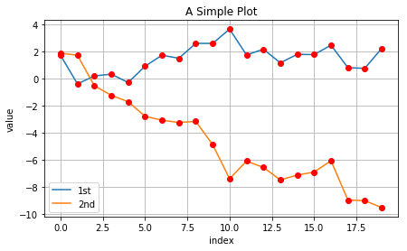
    


```python
y[:, 0] = y[:, 0] * 100
plt.figure(figsize=(7, 4))
plt.plot(y[:, 0], lw=1.5, label='1st')
plt.plot(y[:, 1], lw=1.5, label='2nd')
plt.plot(y, 'ro')
plt.grid(True)
plt.legend(loc=0)
plt.axis('tight')
plt.xlabel('index')
plt.ylabel('value')
plt.title('A Simple Plot')
# tag: matplotlib_7
# title: Plot with two differently scaled data sets
```


    Text(0.5,1,'A Simple Plot')


    

    


```python
fig, ax1 = plt.subplots()
plt.plot(y[:, 0], 'b', lw=1.5, label='1st')
plt.plot(y[:, 0], 'ro')
plt.grid(True)
plt.legend(loc=8)
plt.axis('tight')
plt.xlabel('index')
plt.ylabel('value 1st')
plt.title('A Simple Plot')
ax2 = ax1.twinx()
#共享横坐标，独立的纵坐标，坐标标在右边

plt.plot(y[:, 1], 'g', lw=1.5, label='2nd')
plt.plot(y[:, 1], 'ro')
plt.legend(loc=0)
plt.ylabel('value 2nd')
# tag: matplotlib_8
# title: Plot with two data sets and two y-axes
```


    Text(0,0.5,'value 2nd')


    
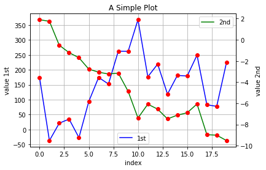
    


```python
plt.figure(figsize=(7, 5))
plt.subplot(211)
plt.plot(y[:, 0], lw=1.5, label='1st')
plt.plot(y[:, 0], 'ro')
plt.grid(True)
plt.legend(loc=0)
plt.axis('tight')
plt.ylabel('value')
plt.title('A Simple Plot')
plt.subplot(212)
plt.plot(y[:, 1], 'g', lw=1.5, label='2nd')
plt.plot(y[:, 1], 'ro')
plt.grid(True)
plt.legend(loc=0)
plt.axis('tight')
plt.xlabel('index')
plt.ylabel('value')
# tag: matplotlib_9
# title: Plot with two sub-plots


```


    Text(0,0.5,'value')


    
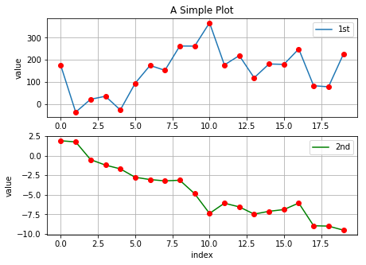
    


+ plt.subplot()分割指定画图区域


```python
plt.figure(figsize=(9, 4))
plt.subplot(221)
plt.plot(y[:, 0], lw=1.5, label='1st')
plt.plot(y[:, 0], 'ro')
plt.grid(True)
plt.legend(loc=0)
plt.axis('tight')
plt.xlabel('index')
plt.ylabel('value')
plt.title('1st Data Set')
plt.subplot(224)
plt.bar(np.arange(len(y)), y[:, 1], width=0.5,
        color='g', label='2nd')
plt.grid(True)
plt.legend(loc=0)
plt.axis('tight')
plt.xlabel('index')
plt.title('2nd Data Set')
# tag: matplotlib_10
# title: Plot combining line/point sub-plot with bar sub-plot
# size: 80
```


    Text(0.5,1,'2nd Data Set')


    

    


## Other Plot Styles


```python
y = np.random.standard_normal((1000, 2))
```

+ 散点图


```python
plt.figure(figsize=(7, 5))
plt.plot(y[:, 0], y[:, 1], 'ro')
plt.grid(True)
plt.xlabel('1st')
plt.ylabel('2nd')
plt.title('Scatter Plot')
# tag: matplotlib_11_a
# title: Scatter plot via +plot+ function
```


    Text(0.5,1,'Scatter Plot')


    
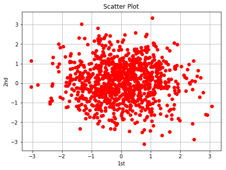
    


+ 可以直接用plt.scatter函数


```python
plt.figure(figsize=(7, 5))
plt.scatter(y[:, 0], y[:, 1], marker='o')
plt.grid(True)
plt.xlabel('1st')
plt.ylabel('2nd')
plt.title('Scatter Plot')
# tag: matplotlib_11_b
# title: Scatter plot via +scatter+ function
```


    Text(0.5,1,'Scatter Plot')


    
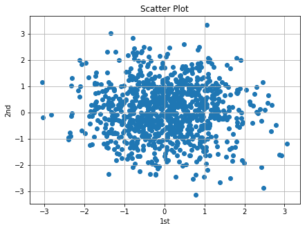
    


+ plt.scatter可以指定颜色


```python
c = np.random.randint(0, 10, len(y))
```


```python
plt.figure(figsize=(7, 5))
plt.scatter(y[:, 0], y[:, 1], c=y[:, 1], marker='o')
plt.colorbar()
plt.grid(True)
plt.xlabel('1st')
plt.ylabel('2nd')
plt.title('Scatter Plot')
# tag: matplotlib_11_c
# title: Scatter plot with third dimension
```


    Text(0.5,1,'Scatter Plot')


    
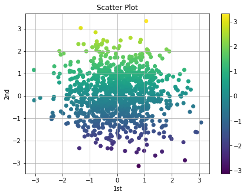
    


+ 直方图


```python
plt.figure(figsize=(7, 4))
plt.hist(y, label=['1st', '2nd'], bins=25)
plt.grid(True)
plt.legend(loc=0)
plt.xlabel('value')
plt.ylabel('frequency')
plt.title('Histogram')
# tag: matplotlib_12_a
# title: Histogram for two data sets
```


    Text(0.5,1,'Histogram')


    
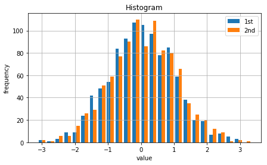
    


+ 直方图 堆叠显示


```python
plt.figure(figsize=(7, 4))
plt.hist(y, label=['1st', '2nd'], color=['b', 'g'],
            stacked=True, bins=20)
plt.grid(True)
plt.legend(loc=0)
plt.xlabel('value')
plt.ylabel('frequency')
plt.title('Histogram')
# tag: matplotlib_12_b
# title: Stacked histogram for two data sets
```


    Text(0.5,1,'Histogram')


    
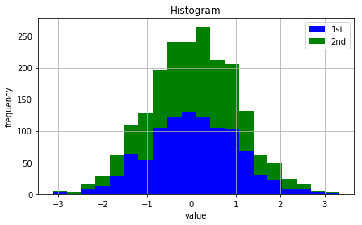
    


+ 盒须图 画分布
+ plt.setp设置图形属性


```python
fig, ax = plt.subplots(figsize=(7, 4))
plt.boxplot(y)
plt.grid(True)
plt.setp(ax, xticklabels=['1st', '2nd'])
plt.xlabel('data set')
plt.ylabel('value')
plt.title('Boxplot')
# tag: matplotlib_13
# title: Boxplot for two data sets
# size: 70
```


    Text(0.5,1,'Boxplot')


    
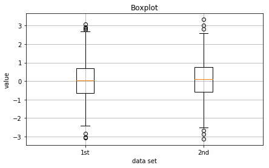
    


## 一些金融问题的图形工具

+ 单利和复利
+ 货币的时间价值
+ 日内数据

### 单利和复利
+ 单利：$FV(simple interest)=PV(1+R* n)$
+ 复利：$FV(compounded  interest)=PV(1+R)^n$ 


```python
import numpy as np
from matplotlib.pyplot import *
from pylab import *
pv=1000
r=0.08
n=10
t=linspace(0,n,n)
y1=np.ones(len(t))*pv
y2=pv*(1+r*t)
y3=pv*(1+r)**t
title('Simple vs. compounded interest rates')
xlabel('Number of years')
ylabel('Values')
xlim(0,11)
ylim(800,2200)
plot(t, y1, 'b-')
plot(t, y2, 'g--',label="Simple")
plot(t, y3, 'r-',label="Compounded")
plt.legend(loc=0)
show()
```


    
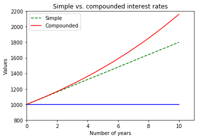
    


### 货币的时间价值

10年前的100万和现在的100万，今天的100万和十年后的100万的价值是不同的。如果我们用散点图大小表示这种差异，可以如下作图可视化这种差异。


```python
from matplotlib.pyplot import *
fig1 = figure(facecolor='white',figsize=(10,6))
ax1 = axes(frameon=False)
ax1.set_frame_on(False)
ax1.get_xaxis().tick_bottom() 
ax1.axes.get_yaxis().set_visible(False) 
plt.ylim(-0.1, 0.1)
plt.xlim(-1, 11)

x=range(0,11,2)
y = [0]*len(x);
rate=1
annotate("今天收到",fontproperties='SimHei',xy=(0,0),xytext=(2,0.08),arrowprops=dict(facecolor='black',shrink=0.02))
annotate("2年后收到",fontproperties='SimHei',xy=(2,0.005),xytext=(3.5,0.06),arrowprops=dict(facecolor='black',shrink=0.02))
annotate("6年后收到",fontproperties='SimHei',xy=(4,0.005),xytext=(5.3,0.06),arrowprops=dict(facecolor='black',shrink=0.02))
annotate("10年后收到",fontproperties='SimHei',xy=(10,-0.005),xytext=(4,-0.06),arrowprops=dict(facecolor='black',shrink=0.02))
s =[4000*(1+rate)**(-n) for n in x]
title(u"不同时刻收到的money现在的价值",fontproperties='SimHei')
xlabel(u"时间（年）",fontproperties='SimHei')
scatter(x,y,s=s);
#plt.axis('tight')
show()
```


    
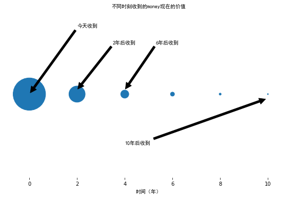
    


日内高频


```python
import pandas as pd
df = pd.read_csv('data/a1501.csv',header=None, parse_dates=[[0, 2]],index_col = 0)
df.index.name="Date"
df.head()
```


<div>
<style scoped>
    .dataframe tbody tr th:only-of-type {
        vertical-align: middle;
    }

    .dataframe tbody tr th {
        vertical-align: top;
    }

    .dataframe thead th {
        text-align: right;
    }
</style>
<table border="1" class="dataframe">
  <thead>
    <tr style="text-align: right;">
      <th></th>
      <th>1</th>
      <th>3</th>
      <th>4</th>
      <th>5</th>
      <th>6</th>
      <th>7</th>
      <th>8</th>
      <th>9</th>
      <th>10</th>
      <th>11</th>
      <th>12</th>
      <th>13</th>
      <th>14</th>
    </tr>
    <tr>
      <th>Date</th>
      <th></th>
      <th></th>
      <th></th>
      <th></th>
      <th></th>
      <th></th>
      <th></th>
      <th></th>
      <th></th>
      <th></th>
      <th></th>
      <th></th>
      <th></th>
    </tr>
  </thead>
  <tbody>
    <tr>
      <th>2014-11-03 08:59:00</th>
      <td>a1501</td>
      <td>0</td>
      <td>4600.0</td>
      <td>284</td>
      <td>4599.0</td>
      <td>13</td>
      <td>4600.0</td>
      <td>67</td>
      <td>46000.00</td>
      <td>13064000.0</td>
      <td>363040</td>
      <td>4754.0</td>
      <td>4390.0</td>
    </tr>
    <tr>
      <th>2014-11-03 09:00:01</th>
      <td>a1501</td>
      <td>0</td>
      <td>4600.0</td>
      <td>290</td>
      <td>4599.0</td>
      <td>18</td>
      <td>4600.0</td>
      <td>64</td>
      <td>46000.00</td>
      <td>13340000.0</td>
      <td>363038</td>
      <td>4754.0</td>
      <td>4390.0</td>
    </tr>
    <tr>
      <th>2014-11-03 09:00:01</th>
      <td>a1501</td>
      <td>0</td>
      <td>4598.0</td>
      <td>354</td>
      <td>4597.0</td>
      <td>42</td>
      <td>4598.0</td>
      <td>1</td>
      <td>45997.40</td>
      <td>16283080.0</td>
      <td>363022</td>
      <td>4754.0</td>
      <td>4390.0</td>
    </tr>
    <tr>
      <th>2014-11-03 09:00:02</th>
      <td>a1501</td>
      <td>0</td>
      <td>4600.0</td>
      <td>370</td>
      <td>4599.0</td>
      <td>3</td>
      <td>4600.0</td>
      <td>69</td>
      <td>45997.30</td>
      <td>17019000.0</td>
      <td>363024</td>
      <td>4754.0</td>
      <td>4390.0</td>
    </tr>
    <tr>
      <th>2014-11-03 09:00:02</th>
      <td>a1501</td>
      <td>0</td>
      <td>4600.0</td>
      <td>756</td>
      <td>4600.0</td>
      <td>7</td>
      <td>4601.0</td>
      <td>51</td>
      <td>45989.71</td>
      <td>34768220.0</td>
      <td>362902</td>
      <td>4754.0</td>
      <td>4390.0</td>
    </tr>
  </tbody>
</table>
</div>


+ 处理相同的时间


```python
import pandas as pd
df = pd.read_csv('data/a1501.csv',header=None, parse_dates=[[0, 2]],index_col = 0)
df.index.name="Date"
df=df.reset_index()
df['Date'] =  df['Date'] + 500*(df['Date'] == df['Date'].shift()).values.astype("timedelta64[ms]")
#如果有若干个同一秒数据：
#df['Date'] =  df['Date'] + (df['Date'].groupby((df['Date'] != df['Date'].shift()).cumsum()).cumcount()).values.astype('timedelta64[ms]')
df = df.set_index('Date')
df.head()
```


<div>
<style scoped>
    .dataframe tbody tr th:only-of-type {
        vertical-align: middle;
    }

    .dataframe tbody tr th {
        vertical-align: top;
    }

    .dataframe thead th {
        text-align: right;
    }
</style>
<table border="1" class="dataframe">
  <thead>
    <tr style="text-align: right;">
      <th></th>
      <th>1</th>
      <th>3</th>
      <th>4</th>
      <th>5</th>
      <th>6</th>
      <th>7</th>
      <th>8</th>
      <th>9</th>
      <th>10</th>
      <th>11</th>
      <th>12</th>
      <th>13</th>
      <th>14</th>
    </tr>
    <tr>
      <th>Date</th>
      <th></th>
      <th></th>
      <th></th>
      <th></th>
      <th></th>
      <th></th>
      <th></th>
      <th></th>
      <th></th>
      <th></th>
      <th></th>
      <th></th>
      <th></th>
    </tr>
  </thead>
  <tbody>
    <tr>
      <th>2014-11-03 08:59:00.000</th>
      <td>a1501</td>
      <td>0</td>
      <td>4600.0</td>
      <td>284</td>
      <td>4599.0</td>
      <td>13</td>
      <td>4600.0</td>
      <td>67</td>
      <td>46000.00</td>
      <td>13064000.0</td>
      <td>363040</td>
      <td>4754.0</td>
      <td>4390.0</td>
    </tr>
    <tr>
      <th>2014-11-03 09:00:01.000</th>
      <td>a1501</td>
      <td>0</td>
      <td>4600.0</td>
      <td>290</td>
      <td>4599.0</td>
      <td>18</td>
      <td>4600.0</td>
      <td>64</td>
      <td>46000.00</td>
      <td>13340000.0</td>
      <td>363038</td>
      <td>4754.0</td>
      <td>4390.0</td>
    </tr>
    <tr>
      <th>2014-11-03 09:00:01.500</th>
      <td>a1501</td>
      <td>0</td>
      <td>4598.0</td>
      <td>354</td>
      <td>4597.0</td>
      <td>42</td>
      <td>4598.0</td>
      <td>1</td>
      <td>45997.40</td>
      <td>16283080.0</td>
      <td>363022</td>
      <td>4754.0</td>
      <td>4390.0</td>
    </tr>
    <tr>
      <th>2014-11-03 09:00:02.000</th>
      <td>a1501</td>
      <td>0</td>
      <td>4600.0</td>
      <td>370</td>
      <td>4599.0</td>
      <td>3</td>
      <td>4600.0</td>
      <td>69</td>
      <td>45997.30</td>
      <td>17019000.0</td>
      <td>363024</td>
      <td>4754.0</td>
      <td>4390.0</td>
    </tr>
    <tr>
      <th>2014-11-03 09:00:02.500</th>
      <td>a1501</td>
      <td>0</td>
      <td>4600.0</td>
      <td>756</td>
      <td>4600.0</td>
      <td>7</td>
      <td>4601.0</td>
      <td>51</td>
      <td>45989.71</td>
      <td>34768220.0</td>
      <td>362902</td>
      <td>4754.0</td>
      <td>4390.0</td>
    </tr>
  </tbody>
</table>
</div>


```python
df.index[:5]
```


    DatetimeIndex([       '2014-11-03 08:59:00',        '2014-11-03 09:00:01',
                   '2014-11-03 09:00:01.500000',        '2014-11-03 09:00:02',
                   '2014-11-03 09:00:02.500000'],
                  dtype='datetime64[ns]', name='Date', freq=None)


```python
 
df[4].plot()
 
```


    <matplotlib.axes._subplots.AxesSubplot at 0x174f58e06d8>


    
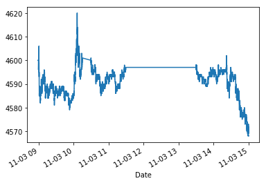
    


```python
tight_layout?
```


```python
%matplotlib inline
from matplotlib.pyplot import *
import matplotlib.dates as dates
fig, (ax1,ax2) = subplots(nrows=1, ncols=2,sharey=True,figsize=(10,6))
df[4]["2014-11-03 08:59:00":"2014-11-03 11:31:00"].plot(ax=ax1) 
df[4]["2014-11-03 13:30:00":"2014-11-03 15:01:00"].plot(ax=ax2) 
#ax1.plot(x1,df[4].ix["2014-11-03 08:59:00":"2014-11-03 11:31:00"].values)
#ax2.plot(x2,df[4].ix["2014-11-03 13:30:00":"2014-11-03 15:01:00"].values)
#plt.axis('tight')
ax1.xaxis.set_major_locator(dates.MinuteLocator(interval=30))
ax1.xaxis.set_major_formatter(dates.DateFormatter('%H:%M'))
ax2.xaxis.set_major_locator(dates.MinuteLocator(interval=20))
ax2.xaxis.set_major_formatter(dates.DateFormatter('%H:%M'))
tight_layout(pad=2, h_pad=1, w_pad=0) 
show()
```


    
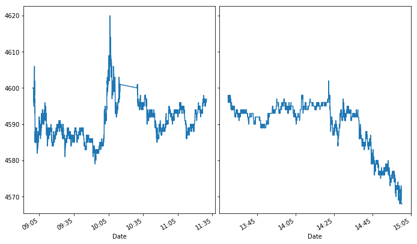
    


```python
 
y1=df[4]["2014-11-03 08:59:00":"2014-11-03 11:31:00"] 
y2=df[4]["2014-11-03 13:30:00":"2014-11-03 15:01:00"] 
mo= pd.date_range( "2014-11-03 09:00:00","2014-11-03 11:31:00",freq='30min')
af= pd.date_range("2014-11-03 13:30:00","2014-11-03 15:01:00",freq='15min')

%matplotlib inline
from matplotlib.pyplot import *
fig, (ax1,ax2) = subplots(nrows=1, ncols=2,sharey=True,figsize=(10,6))
ax1.plot_date(y1.index.to_pydatetime(),y1,"-")
ax2.plot_date(y2.index.to_pydatetime(),y2,"-")
#ax1.xaxis.set_major_locator(dates.MinuteLocator(interval=30))
ax1.xaxis.set_ticks(mo)
ax1.xaxis.set_major_formatter(dates.DateFormatter('%H\n:%M'))
#ax1.xaxis.set_ticklabels
#ax2.xaxis.set_major_locator(dates.MinuteLocator(interval=20))
ax2.xaxis.set_ticks(af)
ax2.xaxis.set_major_formatter(dates.DateFormatter('%H\n:%M'))
tight_layout(pad=0, h_pad=0, w_pad=0) 
show()
```


    
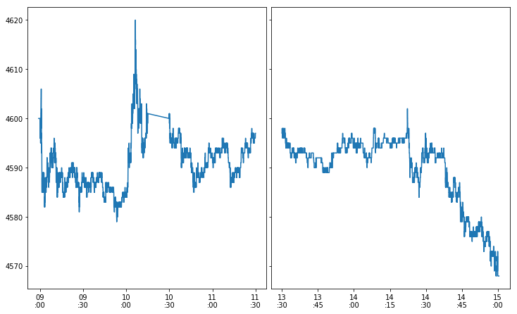
    

